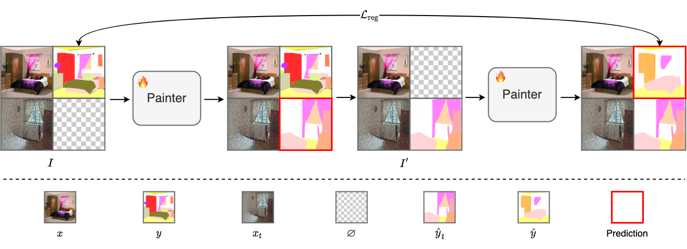

<div align="center">

<h1>Test-Time Visual In-Context Tuning</h1>

<div>
    <a href='https://jiahao000.github.io/' target='_blank'>Jiahao Xie</a><sup>1,2</sup>&emsp;
    <a href='https://alessiotonioni.github.io/' target='_blank'>Alessio Tonioni</a><sup>3</sup>&emsp;
    <a href='https://scholar.google.com/citations?user=OglqhoUAAAAJ&hl=en' target='_blank'>Nathalie Rauschmayr</a><sup>3</sup>&emsp;
    <a href='https://federicotombari.github.io/' target='_blank'>Federico Tombari</a><sup>3</sup>&emsp;
    <a href='https://scholar.google.com/citations?user=z76PBfYAAAAJ&hl=en' target='_blank'>Bernt Schiele</a><sup>1,2</sup>
</div>
<div>
    <sup>1</sup>Max Planck Institute for Informatics&emsp;
    <sup>2</sup>VIA Research Center&emsp;
    <sup>3</sup>Google
</div>

<div>
    <strong>CVPR 2025</strong>
</div>

<div>
    <h4 align="center">
        <a href="https://arxiv.org/abs/2503.21777" target='_blank'>
        
        </a>
        <a href="https://github.com/Jiahao000/VICT" target='_blank'>
        
        </a>
        <a href="https://github.com/Jiahao000/VICT#-citation" target='_blank'>
        
        </a>
    </h4>
</div>

<strong>We present VICT, a test-time visual in-context tuning method that can adapt visual in-context learning models on the fly with a single test sample. VICT can be applied to a wide range of unseen domains and tasks at test time.</strong>

<div style="text-align:center">

</div>

:open_book: For more results, please refer to our <a href="https://arxiv.org/abs/2503.21777" target="_blank">paper</a>

---

</div>

## 📣 News
- [03/2025] 🔥 VICT is released on [arXiv](https://arxiv.org/abs/2503.21777).

## 🌟 Method

VICT is a simple yet effective test-time training approach to adapt visual in-context learning (VICL) models on the fly. The motivation is that each test input offers a hint about the test distribution. Thus, we modify a VICL model at test time to make full use of this hint by setting up a <i>one-sample learning problem</i>.

Specifically, we flip the role between the task prompts and the test sample and use a cycle consistency self-supervised loss to reconstruct the original task prompt output. Our key insight is that a model should be aware of a new test distribution if it can successfully recover the original task prompts.

<div style="text-align:center">

</div>

## 🤗 Qualitative Examples

### Unseen Domains

#### Middle-/High-Level Tasks with Corruptions

<div style="text-align:center">

</div>

#### Low-Level Tasks with Corruptions

<div style="text-align:center">

</div>

### Unseen Tasks

<div style="text-align:center">

</div>

## 👨‍💻 Todo
- [x] Release the [arXiv](https://arxiv.org/abs/2503.21777) version.
- [ ] Release the code.

## 📘 Citation
If you find this work useful for your research, please consider citing our paper:
```bibtex
@inproceedings{xie2025test,
  title = {Test-Time Visual In-Context Tuning},
  author = {Xie, Jiahao and Tonioni, Alessio and Rauschmayr, Nathalie and Tombari, Federico and Schiele, Bernt},
  booktitle={CVPR},
  year = {2025}
}
```
